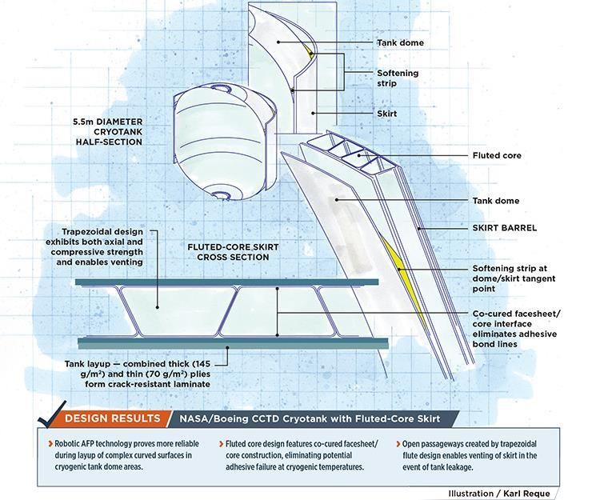
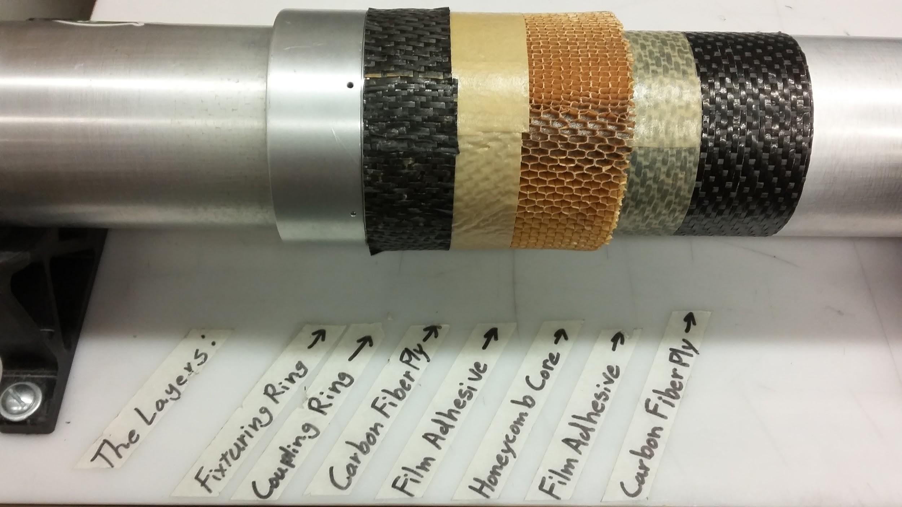

**D****esign and Manufacture of Composite Liquid Oxygen Propellent Tank for University Rocket**

Neil Benkelman,** **Russell Berger, Weldon Peterson,  Alex Farias, Francesca Frattaroli, and Christopher Wilson

*When designing a rocket to overcome Earth’s gravitational force, the dry mass of the propellent tank is the most limiting factor for amateur and university-level rocket teams. Most rocket groups are dependent upon heavy aluminum tanks to hold their liquid propellant. Single-piece, carbon-fiber composite tanks are strong and light, but require expensive **automated fiber placement** techniques that are not a viable option for amateur teams, who operate with a tight budget and limited resources in comparison to their corporate or government counterparts. Portland State University’s composite-tank capstone and research project is an attempt by senior undergraduate engineering students to design, build, and test an affordable, lightweight, composite liquid oxygen (LOX) propellant tank for eventual integration into Portland State Aerospace Society’s 100 kilometer rocket. *

1. **Introduction**

For the past decade, amateur and university rocketry groups have been undertaking an impromptu space race to breach the Von Karman Line (100 km above earth’s surface).  The greatest barrier to success is the ratio of the mass of the fueled rocket to its dry mass. This is commonly referred to as the mass ratio. Tsiolkovsky’s rocket equation shows that the mass ratio must increase exponentially with the rocket’s change in velocity. In simpler terms, if you want to go faster and higher you must decrease your dry weight, and small weight savings make a large difference. Conventional amateur and university rockets are constrained to lower altitudes by the use of either solid propellant or liquid propellant housed in aluminum fuel tanks with relatively low mass ratios.  A mechanical engineering senior capstone group at Portland State University is working to mitigate this dry mass limitation by designing a liquid oxygen propellant tank out of primarily composite materials which will be much lighter than all-aluminum equivalents. This design requires the development of corresponding manufacturing techniques that take into account the differing thermal, chemical, adhesive and structural properties of the composite materials, and their need to interface with each other, and with aluminum components. 

Two previous PSAS capstone groups have focused on improving the overall dry-weight of the PSAS LV3 rocket, a third generation solid-propellant rocket. The 2014 and 2016 Airframe capstone teams developed a unique carbon-fiber composite layup technique (NOTE:  Shields, J. P., and Elwood, L., "Design and Manufacture of an Open-Hardware University Rocket Airframe using Carbon Fiber," AIAA SPACE 2016, American Institute of Aeronautics and Astronautics, 2016.
), in which layers of carbon fiber, adhesive, and nomex honeycomb were laid up onto 6-inch aluminum mating rings, producing 18-inch airframe modules that were then mated together to form the body of the LV3 rocket. Having significantly reduced the mass of the rocket in this way, PSAS is seeking to reduce the mass of the internal components, starting with the propellant tank module.

1. **Significance**

Being able to design a working, lightweight, liquid-propellant tank using resources accessible to a university student organization, will not only assist the PSAS community in achieving its goal of breaching 100km and exploring high altitude science by putting a cubesat into orbit, but provide the greater rocket community with a more affordable and accessible tank design. Due to its nature as an open source project, all results will be posted publicly, allowing any future university or amateur team to benefit.  Additionally, the financial and technical constraints of this project also pose an opportunity to develop unique solutions to the problem of cryotank design that could benefit industry and science as a whole. 

1. **Plan of Work**

	The scope of this project builds on the previous work of other student groups.  As previously noted, a 2016 capstone group developed a layup process and design of a lightweight composite airframe.  Investigation into what techniques, procedures, and materials that can be adapted from this project are already underway.  Additionally, research into composite cryotank technology, (NOTE:  Johnson, T. F., Sleight, D. W., and Martin, R. A., "Structures and Design Phase I Summary for the NASA Composite Cryotank Technology Demonstration Project," 2013, pp. 1–11.) and associated methods and safety protocols has already been done before; PSAS has aggregated hundreds of relevant technical papers and NASA procedural documents which are currently being evaluated by the design team and are expected to inform initial designs, material selection, and testing methods.

Substantial material resources were donated by Boeing and other industry sponsors (8-139 prepreg, 8-222 Cycom 6070/7781, BMS 8-308C 60001, etc.) to PSAS for use with the 2016 capstone and have since been acquired to be used with this Composite Tank design. Existing material resources and composite layering techniques will be tested first, for structural integrity at cryogenic temperatures, before other materials are considered for testing. At the initial design stages, there are many options under consideration: composite types, layering methods, tank geometries, assemblies, and manufacturing procedures will all be researched, developed, and tested for viability at cryogenic temperatures and launch loading conditions. 

<table>
  <tr>
    <td>Figure 1: NASA/Boeing CCTD Cryotank with Fluted-Core Skirt. Illustration: Karl Reque</td>
    <td> Figure 2: 2015-2016 Composite PSAS airframe layer configuration
</td>
  </tr>
</table>

The project is currently in a research and project design phase, along with preliminary material testing and assembly design. During this phase, major design constraints, challenges, and corresponding testing methods are being identified, along with best practices of documentation, analysis, and evaluation.  Major challenges already identified include-- designing tank mating rings to interface with air frame, matching the form factor of an airframe module, developing aluminum tank endcaps to interface and seal with composite body, providing adequate chemical and thermal insulation, and developing a layup of selected materials to fit onto final geometry.  

In identifying viable designs, an iterative design process, coupled with material testing (thermal, tensile, and impact) and finite element analysis (body force and thermal stress analysis) will first be conducted. This will be followed by the fabrication of multiple scale prototypes of designs or design combinations that proved successful. Prototypes will then be subjected to both hydro and cryo testing procedures to identify leaks, rates of thermal conduction, oxygen diffusion, and microcracking and points of structural failure.  Given time, there is potential for a full-scale (LV3-size) prototype tank, subject to the same testing methods and analysis.  Capstone requirements dictate that this research project and associated documentation be completed by mid-June 2017.

 The ultimate goal is to produce a subscale cryogenic fuel tank that can safely contain liquid oxygen at operational pressures (3 ATM (NOTE:   Three ATM is a relatively low pressure for a propellant tank of any size. This low pressure is made possible by the parallel PSAS  development of an electric feed system that will replace the current blowdown system for the LV4 rocket.)) and temperatures (-183 ℃) for the duration of the rocket pre-launch procedure (approx. 1 hour,  depending on tank scale). Documentation of measurements, test methods, and development procedures are of equal importance to successful project completion. This emphasis on documentation is in line with PSAS’ educational mission to advance amature and university-level rocketry by making all of its research and discoveries available to the public.

**Appendix**

i.  System requirements-measurements matrix.

